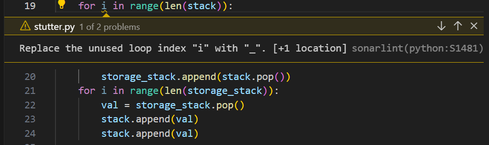

# Static Analysis Report

Written and documented by Doskozhoeva Eliza

## Objective

- The goal of this document is to provide the overview of some implementations of the project by using the static analysis tool to automatically reviewing the code of the project which can result in clean code.

## Tool

- For the tool that we used SonarLint, which is an VS code extension that provides on-the-fly static code analysis within the editor. It highlights potential issues, such as code smells, bugs, or violations of coding standards, as you write or modify code.

### List of the Issues

- Since the project that we using is quite large, so this document coves the static analysis report on only the "stack", "bfs" and "graph" implementations of the project as shown below:

## stack

**Location:** ivt-ha-2024-chuck-chuck\algorithms\stack\is_consecutive.py

- The SonarLint warning (python:S1481) suggests replacing the unused loop index "i" with "_" to indicate that it's intentionally unused. And unused local variable because the "i" not used inside the loop.

**Location:** ivt-ha-2024-chuck-chuck\algorithms\stack\is_sorted.py

-It has same warning as the previous one.

**Location:** ivt-ha-2024-chuck-chuck\algorithms\stack\remove_min.py

- Now it suggests renaming the variable "min" because it's shadowing a built-in function or variable. In Python, "min" is a built-in function used to find the minimum value among a collection of values. That is why it can lead to naming confusion and unintended behavior.

- It has same warning such that we can substitute unnecessary variable since it is not used inside the loop.

**Location:** ivt-ha-2024-chuck-chuck\algorithms\stack\stack.py

- Since this error message is used 4 times, it suggests to defining a constant instead of duplicating it. That reduces the number of potential inconsistencies or errors introduced by multiple occurrences of the same literal string.

**Location:** ivt-ha-2024-chuck-chuck\algorithms\stack\stutter.py

**Location:** ivt-ha-2024-chuck-chuck\algorithms\stack\switch_pairs.py

- It has same warning such that we can substitute unnecessary variable since it is not used inside the loop.

**Location:** ivt-ha-2024-chuck-chuck\algorithms\stack\valid_parenthesis.py

- Since there are no if/else statements it suggest to merge the inner statement with outer. That ensures clearer condition, and simplier code.

**Location:** ivt-ha-2024-chuck-chuck\algorithms\bfs\count_island.py

- Cognitive Complexity is a measure of how hard it is to understand the control flow of a unit of code.  "31" refers to the current Cognitive Complexity score of the function, indicating its level of complexity. While "15" represents the maximum allowed Cognitive Complexity score. Here we have too many nested loops and conditions. That way, the it is suggested to break the complex parts of the code into smaller ones. That will reduce cognitive load and simply it for understanding and debugging.

**Location:** ivt-ha-2024-chuck-chuck\algorithms\bfs\maze_search.py

**Location:** ivt-ha-2024-chuck-chuck\algorithms\bfs\shortest_distance_from_all_buildings.py

- It very similar to the previouse problems. The loop index is not used further in case of "w" and "h". So we can substitute them to "_" to make it more readable and clear.

**Location:** ivt-ha-2024-chuck-chuck\algorithms\bfs\word_ladder.py

- As we may notice the function is not quite readable, because of the multiple nested loops and conditions. That is why SonarLint suggests to break down the code block into separate functions or simplify them to reduce the overall complexity.

**Location:** ivt-ha-2024-chuck-chuck\algorithms\graph\find_path.py

- Using "start not in graph" instead of "not start in" simplifies the condition, making it more concise and readable. This change ensures clarity and reduces the potential for misinterpretation, improving maintainability and reducing the risk of introducing bugs.
