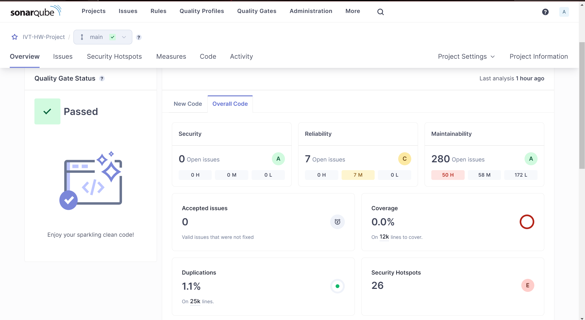
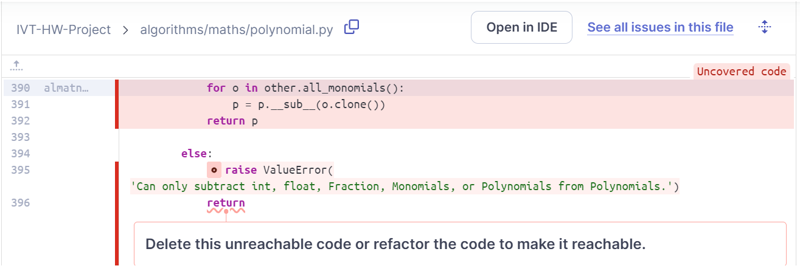
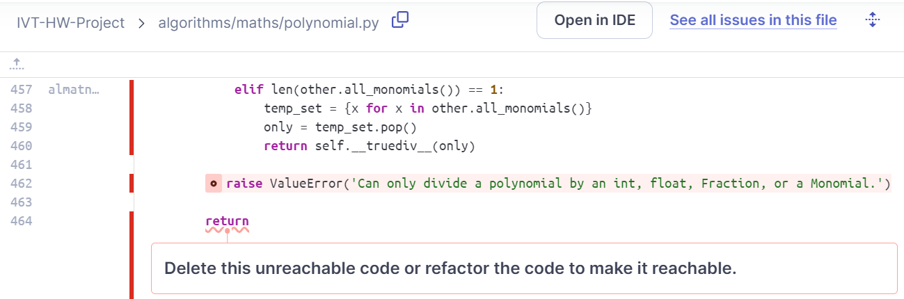
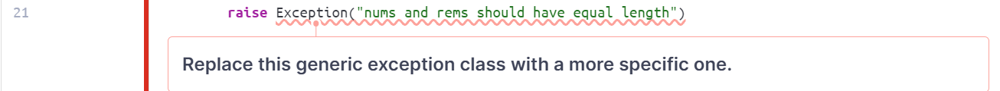
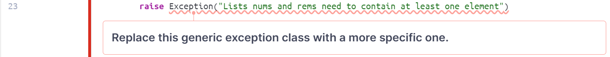
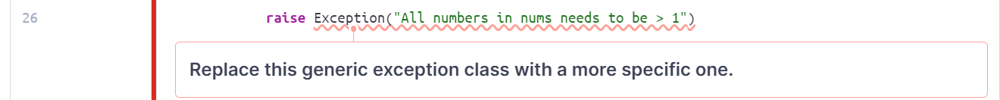
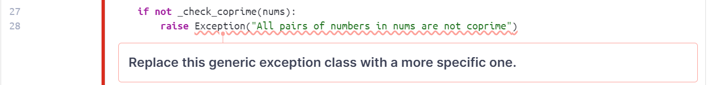
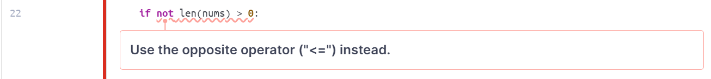
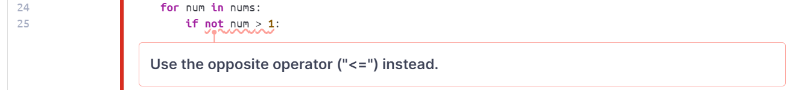
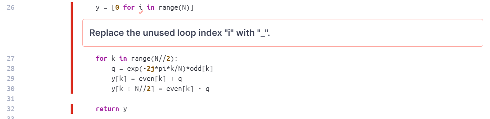

# Static Analysis Report

## Objective

- The goal of this document is to provide the overview of the maths implementation of the project by using the static analysis tool to automatically reviewing the code of the project which can result in clean code.

## Tool

- For the tool that we used for running the static analysis is SonarQube which is an open source platform for inspecting code quality that perform automatic reviews with static analysis of code to detect bugs and code smells on the project.

## Overview of the Project

### Quality Gate Status:

- SonarQube has indicated that the project meets the redefined quality criteria set in SonarQube's Quality Gate. This is a good sign that the project's codebase maintains a standard of quality.

### Sections Overview:

- Security: no open issues which indicates that there aren't any issues detected in the changes concerning the security of the project after making changes.
- Reliability: 7 open issues were showing and marked as Medium severity (M). These issues pertain to potential bugs in the code that could affect the application’s behavior but are not critical.
- Maintainability: 280 Open issues which consisting of 50 High(H), 58 Medium(M), 172 Low(L). This suggests the areas in the code that might be complex, potentially poorly documented, or challenging to modify and maintain.

### List of the Issues

Since the project that we using is quite large, so we decide to document the static analysis report on only the maths implementation of the project as shown below:

#### Reliability Issues:

**Location:** ivt-ha-2024-chuck-chuck\algorithms\maths\polynomial.py

- These issues indicate that there is an unreachable code and need can be delete or refactor since we already raising the error, there is no point of returning.

#### Maintainability Issues:

**Location:** ivt-ha-2024-chuck-chuck\algorithms\maths\chinese_remainder_theorem.py

- This issue indicates that the usage of the operator is wrong and it is preferrable to use the '!=' operator which is straightforward instead of the combination of the 'not' keyword with the '==' operator which is less readable.

- These issues indicate that it is not good to raise the generic exception class like this which will cause a negative impact on any code that is trying to catch this exceptions. It is better to catch exception that are intended to be catch. Ex: ValueError()...etc.

- These issues indicate that the usage of the operator is wrong and it is better to use the '<=' operator instead rather than using the combination of the 'not' keyword and the '>' operator which is confusing.

**Location:** ivt-ha-2024-chuck-chuck\algorithms\maths\fft.py

- This issue indicates that the unused loop index which is an unused local variable can be named with '\_' symbol instead of using 'i' which may lead to curiosity of variable being declared but not use or causing a bug or incomplete code.

**Location:** ivt-ha-2024-chuck-chuck\algorithms\maths\polynomial.py
