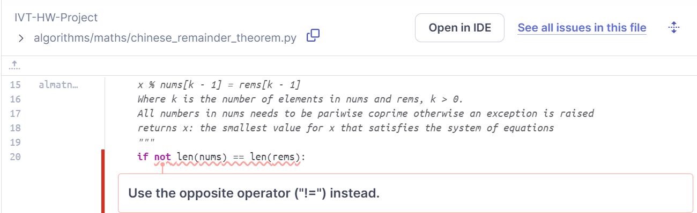
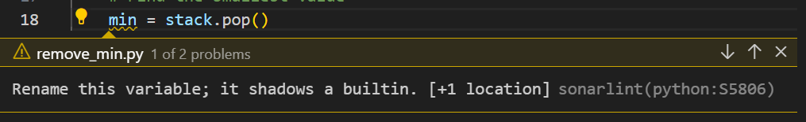
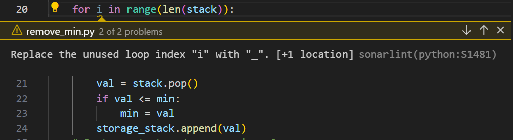
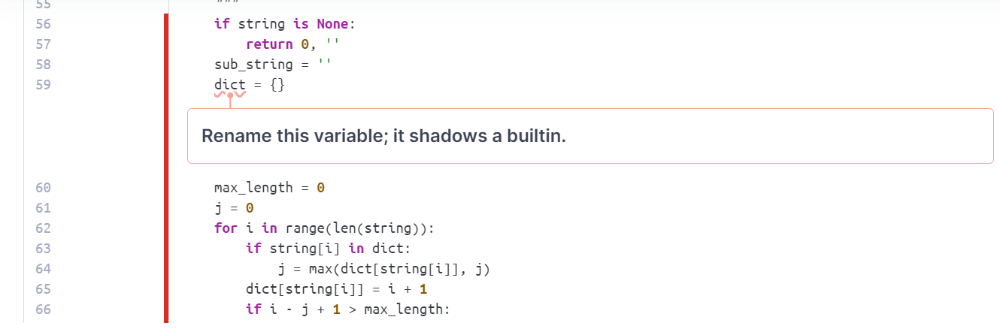

# Static Analysis Report

Written and documented by Mean Diamand

## Objective

- The goal of this document is to provide the overview of some implementations of the project by using the static analysis tool to automatically reviewing the code of the project which can result in clean code.

## Tool

- For the tool that we used for running the static analysis is SonarQube which is an open source platform for inspecting code quality that perform automatic reviews with static analysis of code to detect bugs and code smells on the project.

## Overview of the Project

### Quality Gate Status:

- SonarQube has indicated that the project meets the redefined quality criteria set in SonarQube's Quality Gate. This is a good sign that the project's codebase maintains a standard of quality.

### Sections Overview:

- Security: no open issues which indicates that there aren't any issues detected in the changes concerning the security of the project after making changes.
- Reliability: 7 open issues were showing and marked as Medium severity (M). These issues pertain to potential bugs in the code that could affect the application’s behavior but are not critical.
- Maintainability: 280 Open issues which consisting of 50 High(H), 58 Medium(M), 172 Low(L). This suggests the areas in the code that might be complex, potentially poorly documented, or challenging to modify and maintain.

### List of the Issues

Since the project that we using is quite large, so we decide to document the static analysis report on only the some implementations of the project as shown below:

## maths

#### Reliability Issues:

**Location:** ivt-ha-2024-chuck-chuck\algorithms\maths\polynomial.py

- These issues indicate that there is an unreachable code and need can be delete or refactor since we already raising the error, there is no point of returning.

#### Maintainability Issues:

**Location:** ivt-ha-2024-chuck-chuck\algorithms\maths\chinese_remainder_theorem.py

- This issue indicates that the usage of the operator is wrong and it is preferrable to use the '!=' operator which is straightforward instead of the combination of the 'not' keyword with the '==' operator which is less readable.

- These issues indicate that it is not good to raise the generic exception class like this which will cause a negative impact on any code that is trying to catch this exceptions. It is better to catch exception that are intended to be catch. Ex: ValueError()...etc.

- These issues indicate that the usage of the operator is wrong and it is better to use the '<=' operator instead rather than using the combination of the 'not' keyword and the '>' operator which is confusing.

**Location:** ivt-ha-2024-chuck-chuck\algorithms\maths\fft.py

- This issue indicates that the unused loop index which is an unused local variable can be named with '\_' symbol instead of using 'i' which may lead to curiosity of variable being declared but not use or causing a bug or incomplete code.

**Location:** ivt-ha-2024-chuck-chuck\algorithms\maths\polynomial.py

- These issues indicate that the 'add' and 'sub' methods handle additions/subtraction with int, float, and Fraction types but not the Monomial object type which is different from the declared type and could lead to type errors.

- This issue indicates that having a nested function and lambdas can create tricky bugs when the variable and the function are defined in a loop.If the function is called in another iteration or after the loop finishes, it will see the variables' last value instead of seeing the values corresponding to the iteration where the function was defined.

- These issues indicate that the 'return' is not needed since we already raise error exception which make 'return' to be unreachable.

- This issue indicates that there is a code duplication in the other branch of the conditional statement which can make the code hard to read, understand and maintain. Ex: when you want to modify one of the branch and you might forget to modify the other one which is the same. The best way is to merge it together into on branch of conditional statement.

**Location:** ivt-ha-2024-chuck-chuck\algorithms\maths\pythagoras.py

- This issue indicates that there is an empty 'except' clause which is not preferrable since it will catches all type of exceptions that can result in unexpected errors or bugs in the program. It is better to specify the type of the exception such as ValueError, TypeError...etc.

**Location:** ivt-ha-2024-chuck-chuck\algorithms\maths\rabin_miller.py

- This issue indicates the complexity of the method that required some refactoring to reduce its Cognitive Complexity. This issue was raised due to how hard to understand the control flow of this method and hard to read, test and modify. The method was complex due to the nested function that it is having. The better way is to separate it into smaller functions which make it easy to understand, readable and also easy for extending/modification.

**Location:** ivt-ha-2024-chuck-chuck\algorithms\maths\rsa.py

- This issue is also the same as the previous one which indicates about the complexity of the method that requirement separation into smaller and understandable functions which help to reduce the Cognitive Complexity of the function.

- This issue indicates the wrong usage of the operator. In the code, using a combination between 'not' keyword with the '==' operator is not preferrable and may lead to confusion. It is better to use '!=' operator instead which is more straightforward and easy to understand.

<<<<<<< HEAD
## stack

**Location:** ivt-ha-2024-chuck-chuck\algorithms\stack\is_consecutive.py

- The SonarLint warning (python:S1481) suggests replacing the unused loop index "i" with "_" to indicate that it's intentionally unused. And unused local variable because the "i" not used inside the loop.

**Location:** ivt-ha-2024-chuck-chuck\algorithms\stack\is_sorted.py

-It has same warning as the previous one.

**Location:** ivt-ha-2024-chuck-chuck\algorithms\stack\remove_min.py

- Now it suggests renaming the variable "min" because it's shadowing a built-in function or variable. In Python, "min" is a built-in function used to find the minimum value among a collection of values. That is why it can lead to naming confusion and unintended behavior.

-It has same warning such that we can substitute unnecessary variable since it is not used inside the loop.

=======
## arrays

**Location:** ivt-ha-2024-chuck-chuck\algorithms\arrays/longest_non_repeat.py

- This issue indicates the usage of variable name matches the name of the builtin in Python which make the builtin to be no longer accessible through its original name since this local variable has replaced it. This might cause bugs as you might reference the builtin by mistake. It is better to rename it to something else which helps improving the readability and easy to understand

**Location:** ivt-ha-2024-chuck-chuck\algorithms\arrays/move_zeros.py

- This issue indicates that this is a wrong way to do direct type comparsion is not preferrable to use the '!=' operator which is actually used for checking the value that is not equal. To perform the type comparison in Python, it is recommended to use the combination of 'not' keyword with the isinstance() builtin function which can check whether the object belongs to the a subclass of the specified class providing maintainability and extensible.

- This issue indicates the complexity of the 'n_sum' function is too complex and require some refactoring since this function contained so many duplicated conditional statement branch that can be form into one statement branch and the function can be separate into smaller and simple functions which provide readability, easy to maintain, and easy to understand.

- This issue indicates that the commented-out code distracts the focus from the actual executed code. It creates a noise that increases maintenance code. And because it is never executed, it quickly becomes out of date and invalid.
>>>>>>> 17bc5aa7c1eae4ec41b6acd89e9dceb601990474
