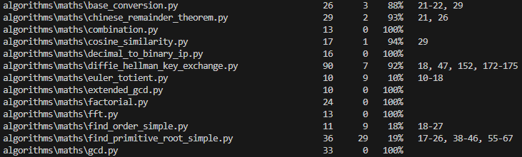
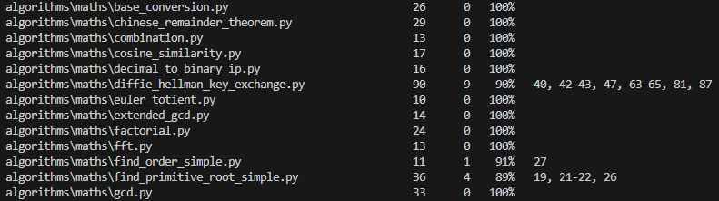
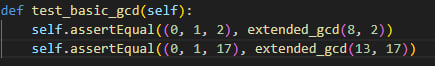

# Unit Tests Documentation

## Overview

This document summarizes the results of improving and extending unit testing within the codebase. The review aimed to verify tests as well as improve code coverage.

## Contributors
- Csarkovszkij Artyjom | Neptun: N852Z8

## Coverage before our work

## Files for which unit tests were extended
- base_conversion.py
- chinese_remainder_theorem.py
- cousine_similarity.py
- diffie_hellman_key_exchange.py
- euler_totient.py
- finder_order_simple.py
- find_primitive_root_simple.py
- generate_strobogrammtic.py

## Coverage after our work

## extended_gcd.py

Deleted, improved and extended Unit tests for this module.

Initial quality of unit tests for this module was awful.