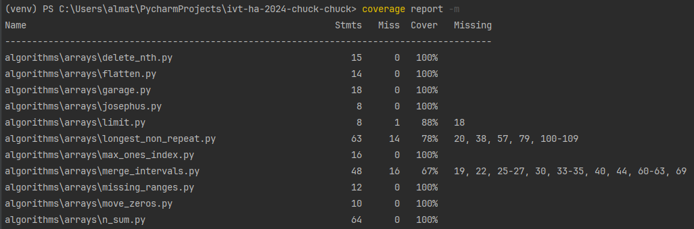

# Overview

The task is to get started with coverage.py, a powerful tool for measuring code coverage. [Official documentation](https://coverage.readthedocs.io/en/latest/)
## Integrating Coverage.py

1. **Generate Coverage Data:**
   Initiate coverage tracking by running the following command in terminal:
     ```
     coverage run -m unittest discover tests
     ```
   it starts monitoring the execution of tests across project

2. **View Detailed Coverage Report:**
   To get a detailed report from generated data, run:
     ```
     coverage report -m
     ```
   The `-m` option adds missing line numbers to the report. The result will be as follows:
   

## Results and Lessons Learned

We learned how to verify the quality of the unit tests, that there are might be some lines that were missed by all the tests, which may lead to bad consequences in real world projects. Learned how to generate reports in suitable formats (pdf). As well as learned how the data gathering is performed by coverage (it stores the data in local db, which can be manipulated).
After writing some unit tests its crucial to check coverage to make sure that every line is tested.